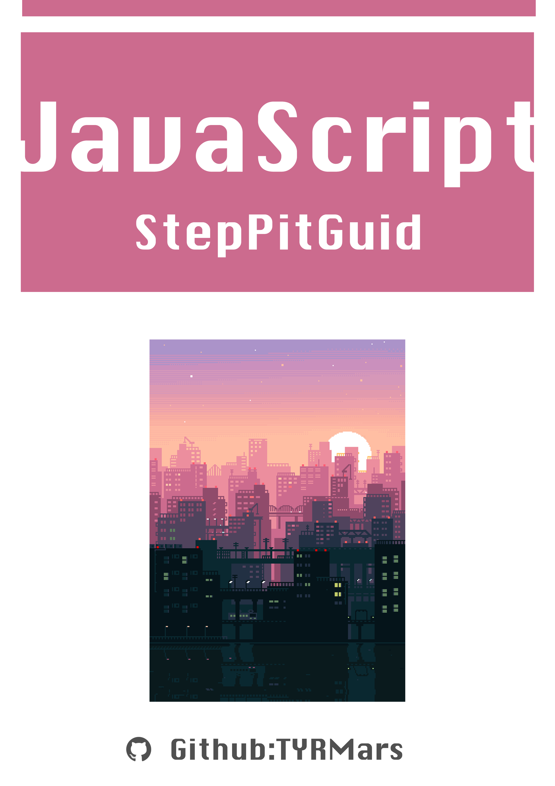
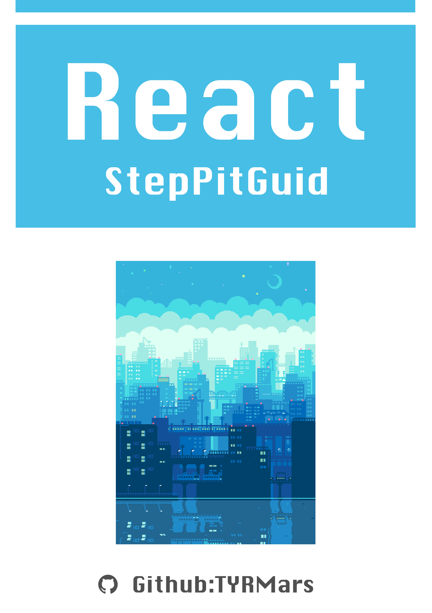

<h3 align="left">使用的语言与工具</h3>

        

  

::: tip

* 求知若飢，虛心若愚 (Stay Hungry Stay Foolish)
* 在开发中，使用任何的工具库都是一把双刃剑，不必推崇之际，趋利避害即可。

:::

## 踩坑指南系列

|     |   |
|  ----  | ----  |
| JavaScript  | React |

## JavaScript

[ES6学习 - ES6-StepPitGuide](https://github.com/TYRMars/ES6-StepPitGuide)

[前端安全 - WebSafe-StepPitGuide](https://github.com/TYRMars/WebSafe-StepPitGuide)

## Node.js

[『Node.js』FFmpeg与Node.js (1) 初识FFmpeg与视频知识](https://segmentfault.com/a/1190000021366234)

[『Node.js』FFmpeg与Node.js (2) Node.js 操作 FFmpeg 工具选择](https://segmentfault.com/a/1190000022026917)
