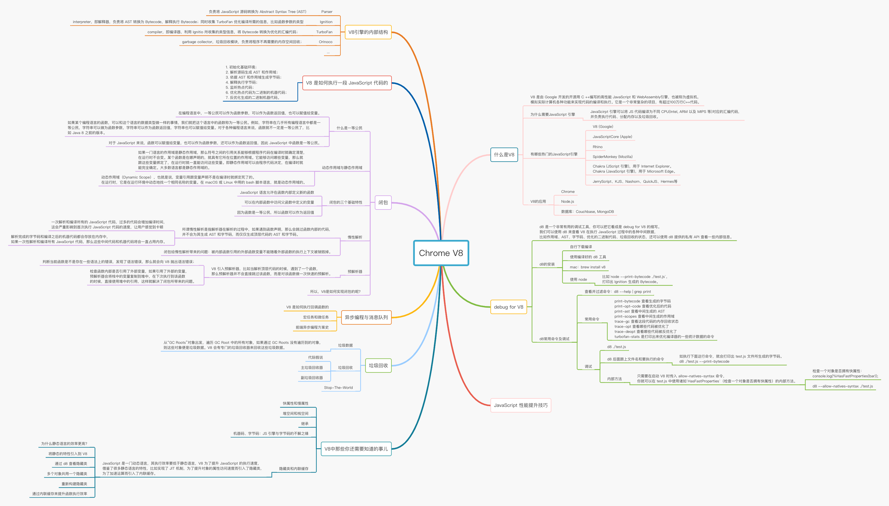

## 2021-08-11 日记

### webpack 打包内存溢出

webpack 运行项目内存溢出(Last few GCs)

方案记录：[webpack 运行项目内存溢出](https://blog.csdn.net/Gx0525_/article/details/114663268)

## 2021-08-04 日记

### V8学习



## 2021-07-28 日记

### Chrome  请求限制

chrome 限制了同一个域名下同时只能有 6 个请求。
然后这个页面上有 6 个以上的视频时，前 6 个视频开始下载，第 7 个会停在那里，等前面下载完释放一个连接出来。
然后视频很大的话，表现就是除了前 6 个视频之外，其他视频都无法播放。
解决方案一是 开启 http2 支持，http2 可以共享一个 tcp 连接，不受 6 个连接的限制。
解决方案二是 视频请求时返回 partial-content ，比如每次只返回 5M， 这样可以把连接释放出来。

## 2021-05-16 日记

### requestAniamtionFrame 遇到的问题

window.requestAnimationFrame() 告诉浏览器——你希望执行一个动画，并且要求浏览器在下次重绘之前调用指定的回调函数更新动画。该方法需要传入一个回调函数作为参数，该回调函数会在浏览器下一次重绘之前执行。

当你准备更新动画时你应该调用此方法。这将使浏览器在下一次重绘之前调用你传入给该方法的动画函数(即你的回调函数)。回调函数执行次数通常是每秒60次，但在大多数遵循W3C建议的浏览器中，回调函数执行次数通常与浏览器屏幕刷新次数相匹配。

在Android 9 中出现了执行[animejs](https://animejs.com/)动画后，requestAnimationFrame会报错。

自己想了一个比较好的解决方案使用

```TypeScript
// fix requestAnimationFrame in Android 9
const requestAnimationFrameFunc = requestAnimationFrame.bind(window)

let lastTime = 0

window.requestAnimationFrame = (callback: FrameRequestCallback) => {
  try {
    return requestAnimationFrameFunc(callback)
  } catch (e) {
    window.requestAnimationFrame = (callback) => {
      const currTime = new Date().getTime()
      const timeToCall = Math.max(0, 16 - (currTime - lastTime))
      const id = window.setTimeout(function () {
        callback(currTime + timeToCall)
      }, timeToCall)
      lastTime = currTime + timeToCall
      return id
    }
    return requestAnimationFrame(callback)
  }
}
```

## 2021-04-14 日记

字体相关

### 浏览器解析字体

最先了解字体显示时间轴的概念。

block(阻塞) -> swap(交换) -> failure(失败)

#### 字体显示时间轴

字体显示时间线基于一个计时器，该计时器在用户代理尝试使用给定下载字体的那一刻开始。时间线分为三个时间段，在这三个时间段中指定使用字体的元素的渲染行为。

##### 字体阻塞周期

如果未加载字体，任何试图使用它的元素都必须渲染不可见的后备字体。如果在此期间字体已成功加载，则正常使用它。

##### 字体交换周期

如果未加载字体，任何尝试使用它的元素都必须呈现后备字体。如果在此期间字体已成功加载，则正常使用它。

##### 字体失败周期

如果未加载字体，用户代理将其视为导致正常字体回退的失败加载。

## 2021-04-11 日记

### Electron 构建

寻找构建Electron + React方式

[electron-react-boilerplate](https://github.com/electron-react-boilerplate/electron-react-boilerplate)

## 2021-04-06 日记

### 组件设计

今天有一个需求，需要在移动端实现NumberPicker，需要实现的是0-9可以循环选择组件。设计组件的时候参考了一下antd mobile

```tsx
import React, { useRef, useState, useEffect } from "react"

export interface PasswordNumberPickerProps {
  disabled?: boolean
  selectedValue?: any
  onValueChange?: (value: any) => void
  itemStyle?: any
  indicatorStyle?: any
  maskStyle?: any
  className?: string
  defaultSelectedValue?: any
  style?: any
  onScrollChange?: (value: any) => void
  noAnimate?: boolean
  useCircle?: boolean
}

export interface PasswordNumberPickerItemProps {
  className?: string
  value: number
  children?: React.ReactNode
  style: any
}

const PasswordNumberPickerItem = (_props: PasswordNumberPickerItemProps) => null

const PasswordNumberPicker = (props: any) => {
  let selectedValueState
  const { selectedValue, defaultSelectedValue, itemStyle } = props
  if (selectedValue !== undefined) {
    selectedValueState = selectedValue
  } else if (defaultSelectedValue !== undefined) {
    selectedValueState = defaultSelectedValue
  } else {
    const children: any = React.Children.toArray(props.children)
    selectedValueState = children && children[0] && children[0].props.value
  }
  const [selectValue, setSelectValue] = useState(selectedValueState)
  const rootRef = useRef<HTMLDivElement>(null)
  const maskRef = useRef<HTMLDivElement>(null)
  const contentRef = useRef<HTMLDivElement>(null)
  const indicatorRef = useRef<HTMLDivElement>(null)
  const itemHeight = useRef(0)
  const scrollValue = useRef(-1)

  const select = (
    value: number,
    itemHeight: number,
    scrollTo: (val: number) => void,
  ) => {
    const children: any = React.Children.toArray(props.children)
    for (let i = 0, len = children.length; i < len; i++) {
      if (children[i].props.value === value) {
        selectByIndex(i, itemHeight, scrollTo)
        return
      }
    }
    selectByIndex(0, itemHeight, scrollTo)
  }

  const selectByIndex = (
    index: number,
    itemHeight: number,
    zScrollTo: (val: number) => void,
  ) => {
    if (
      index < 0 ||
      index >= React.Children.count(props.children) ||
      !itemHeight
    ) {
      return
    }
    zScrollTo(index * itemHeight)
  }

  const computeChildIndex = (
    top: number,
    itemHeight: number,
    childrenLength: number,
  ) => {
    const index = Math.round(top / itemHeight)
    return Math.min(index, childrenLength - 1)
  }

  const onScrollChange = () => {
    const top = scrollHandlers.getValue()
    if (top >= 0) {
      const children = React.Children.toArray(props.children)
      const index = computeChildIndex(top, itemHeight.current, children.length)
      if (scrollValue.current !== index) {
        scrollValue.current = index
        const child: any = children[index]
        if (child && props.onScrollChange) {
          props.onScrollChange(child.props.value)
        } else if (!child && console.warn) {
          console.warn("child not found", children, index)
        }
      }
    }
  }

  const fireValueChange = (selectedValue: any) => {
    if (selectedValue !== selectedValue) {
      if (!("selectedValue" in props)) {
        setSelectValue({
          selectedValue,
        })
      }
      if (props.onValueChange) {
        props.onValueChange(selectedValue)
      }
    }
  }

  const scrollingComplete = () => {
    const top = scrollHandlers.getValue()
    if (top >= 0) {
      const children = React.Children.toArray(props.children)
      const index = computeChildIndex(top, itemHeight.current, children.length)
      const child: any = children[index]
      if (child) {
        fireValueChange(child.props.value)
      } else if (console.warn) {
        console.warn("child not found", children, index)
      }
    }
  }

  const scrollTo = (top: number) => {
    scrollHandlers.scrollTo(0, top)
  }

  const scrollHandlers = (() => {
    let scrollY = -1
    let lastY = 0
    let startY = 0
    let scrollDisabled = false
    let isMoving = false

    const setTransform = (nodeStyle: CSSStyleDeclaration, value: any) => {
      nodeStyle.transform = value
      nodeStyle.webkitTransform = value
    }

    const setTransition = (nodeStyle: CSSStyleDeclaration, value: any) => {
      nodeStyle.transition = value
      nodeStyle.webkitTransition = value
    }

    const scrollTo = (_x: number, y: number, time = 0.3) => {
      if (scrollY !== y && contentRef.current) {
        scrollY = y
        if (time && !props.noAnimate) {
          setTransition(
            contentRef.current.style,
            `cubic-bezier(0,0,0.2,1.15) ${time}s`,
          )
        }
        setTransform(contentRef.current.style, `translate3d(0,${-y}px,0)`)
        setTimeout(() => {
          scrollingComplete()
          if (contentRef.current) {
            setTransition(contentRef.current.style, "")
          }
        }, +time * 1000)
      }
    }

    const Velocity = ((minInterval = 30, maxInterval = 100) => {
      let _time = 0
      let _y = 0
      let _velocity = 0
      const recorder = {
        record: (y: number) => {
          const now = +new Date()
          _velocity = (y - _y) / (now - _time)
          if (now - _time >= minInterval) {
            _velocity = now - _time <= maxInterval ? _velocity : 0
            _y = y
            _time = now
          }
        },
        getVelocity: (y: number) => {
          if (y !== _y) {
            recorder.record(y)
          }
          return _velocity
        },
      }
      return recorder
    })()

    const onFinish = () => {
      isMoving = false
      let targetY = scrollY

      const height = ((props.children as any).length - 1) * itemHeight.current

      let time = 0.3

      const velocity = Velocity.getVelocity(targetY) * 4
      if (velocity) {
        targetY = velocity * 40 + targetY
        time = Math.abs(velocity) * 0.1
      }

      if (targetY % itemHeight.current !== 0) {
        targetY = Math.round(targetY / itemHeight.current) * itemHeight.current
      }

      if (targetY < 0) {
        targetY = 0
      } else if (targetY > height) {
        targetY = height
      }

      scrollTo(0, targetY, time < 0.3 ? 0.3 : time)
      onScrollChange()
    }

    const onStart = (y: number) => {
      if (scrollDisabled) {
        return
      }

      isMoving = true
      startY = y
      lastY = scrollY
    }

    const onMove = (y: number) => {
      if (scrollDisabled || !isMoving) {
        return
      }

      scrollY = lastY - y + startY
      Velocity.record(scrollY)

      onScrollChange()
      if (contentRef.current) {
        setTransform(contentRef.current.style, `translate3d(0,${-scrollY}px,0)`)
      }
    }

    return {
      touchstart: (evt: React.TouchEvent<HTMLDivElement>) =>
        onStart(evt.touches[0].pageY),
      mousedown: (evt: React.MouseEvent<HTMLDivElement>) => onStart(evt.pageY),
      touchmove: (evt: React.TouchEvent<HTMLDivElement>) => {
        evt.preventDefault()
        onMove(evt.touches[0].pageY)
      },
      mousemove: (evt: React.MouseEvent<HTMLDivElement>) => {
        evt.preventDefault()
        onMove(evt.pageY)
      },
      touchend: () => onFinish(),
      touchcancel: () => onFinish(),
      mouseup: () => onFinish(),
      getValue: () => {
        return scrollY
      },
      scrollTo,
      setDisabled: (disabled = false) => {
        scrollDisabled = disabled
      },
    }
  })()

  const passiveSupported = () => {
    let passiveSupported = false

    try {
      const options = Object.defineProperty({}, "passive", {
        get: () => {
          passiveSupported = true
        },
      })
      window.addEventListener("test", null as any, options)
    } catch (err) {}
    return passiveSupported
  }

  useEffect(() => {
    if (
      rootRef.current &&
      contentRef.current &&
      indicatorRef.current &&
      maskRef.current
    ) {
      const rootHeight = rootRef.current.getBoundingClientRect().height
      const itemHeightState = (itemHeight.current = indicatorRef.current.getBoundingClientRect().height)
      console.log(rootHeight, itemHeightState)
      let num = Math.floor(rootHeight / itemHeightState)
      if (num % 2 === 0) {
        num--
      }
      num--
      num /= 2
      contentRef.current.style.padding = `${itemHeightState * num}px 0`
      indicatorRef.current.style.top = `${itemHeightState * num}px`
      maskRef.current.style.backgroundSize = `100% ${itemHeightState * num}px`
      scrollHandlers.setDisabled(props.disabled)
      select(selectValue, itemHeightState, scrollTo)

      const passiveSupportedState = passiveSupported()
      const willPreventDefault = passiveSupportedState
        ? { passive: false }
        : false
      const willNotPreventDefault = passiveSupportedState
        ? { passive: true }
        : false
      Object.keys(scrollHandlers).forEach((key) => {
        if (
          (key.indexOf("touch") === 0 || key.indexOf("mouse") === 0) &&
          rootRef.current
        ) {
          const pd =
            key.indexOf("move") >= 0
              ? willPreventDefault
              : willNotPreventDefault
          rootRef.current.addEventListener(key, scrollHandlers[key], pd as any)
        }
      })
    }
  }, [selectValue, props.disabled, props.itemStyle])

  const map = (item: any) => {
    const {
      className = "password-number-roller-item",
      style,
      value,
    } = item.props
    return (
      <div
        style={{
          fontSize: "16px",
          height: "30px",
          lineHeight: 1,
          padding: "0 10px",
          whiteSpace: "nowrap",
          position: "relative",
          overflow: "hidden",
          textOverflow: "ellipsis",
          background: "#ffffff",
          color: "#29627a",
          width: "100%",
          boxSizing: "border-box",
          ...itemStyle,
          ...style,
        }}
        className={`${selectedValue === value ? "select" : ""} ${className}`}
        key={value}
      >
        {item.children || item.props.children}
      </div>
    )
  }

  const items = React.Children
    ? React.Children.map(props.children, map)
    : ([] as any[]).concat(props.children).map(map)

  return (
    <div
      className="password-number-picker"
      ref={rootRef}
      style={{
        display: "block",
        position: "relative",
        overflow: "hidden",
        width: "100%",
        height: "90px",
        flex: 1,
        background: "#ffffff",
        textAlign: "center",
        ...props.style,
      }}
    >
      <div
        className="password-number-mask"
        style={{
          position: "absolute",
          left: 0,
          top: 0,
          height: "100%",
          width: "100%",
          margin: "0 auto",
          zIndex: 3,
          backgroundImage:
            "linear-gradient(to bottom, rgba(213, 247, 255, 0.60), rgba(213, 247, 255, 0.3)), linear-gradient(to top, rgba(213, 247, 255, 0.60), rgba(213, 247, 255, 0.3))",
          backgroundPosition: "top, bottom",
          backgroundSize: "100% 100px",
          backgroundRepeat: "no-repeat",
          ...props.maskStyle,
        }}
        ref={maskRef}
      />
      <div
        className="password-number-indicator"
        style={{
          boxSizing: "border-box",
          width: "100%",
          height: "30px",
          position: "absolute",
          left: 0,
          zIndex: 3,
          ...props.indicatorStyle,
        }}
        ref={indicatorRef}
      />
      <div
        className="password-number-picker-roller"
        style={{
          position: "absolute",
          left: 0,
          top: 0,
          width: "100%",
          zIndex: 1,
        }}
        ref={contentRef}
      >
        {items}
      </div>
    </div>
  )
}

const _PasswordNumberPicker = React.forwardRef(PasswordNumberPicker)
export {
  _PasswordNumberPicker as PasswordNumberPicker,
  PasswordNumberPickerItem,
}
```

## 2021-04-05 日记

### Array.from 与 Array.fill

今天在用`Array(8).fill(Array(8).fill(false))`的时候发现。创建出来的二维数组`[i][j]`在做push和pop操作，它每一项都会push、pop。查询后发现当一个对象或者数组传递给fill的时候，填充数组的是这个对象或者数组的引用（地址信息），也就是同一个对象或者数组。

::: tip
`Array.from()` 方法从一个类似数组或可迭代对象创建一个新的，浅拷贝的数组实例。

`Array.fill()` 方法用一个固定值填充一个数组中从起始索引到终止索引内的全部元素。不包括终止索引。
:::

经过查询发现可以使用`Array.from()`来创建新的数组，它的第一个参数可以传入伪数组对象（拥有一个 length 属性和若干索引属性的任意对象）。第二个可选参数`mapFn`，等于在生成的数组再执行一次map方法然后返回。`Array.from({ length: 8 }, (e) => Array(8).fill(false))`
