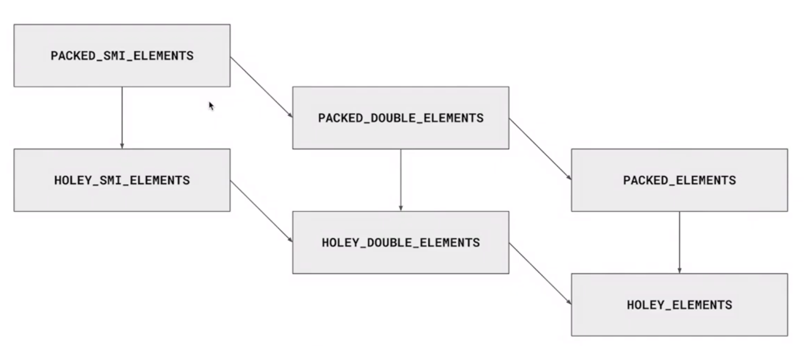

## 性能指标

### lightHouse

* First Contentful Paint (首次渲染)
* Speed Index （速度指数，所有内容看到）
* Largest Contentful （最大内容花了多久）
* Time to Interactive （何时用户可以交互）
* Total Blocking Time
* Cumulatice Layout Shift

#### 优化提示

* Remove unused JavaScript 移除无用JavaScript
* Eliminate render-blocking resources 阻塞JS

### 性能指标PerformanceAPI

* DNS 解析耗时： domainLookupEnd - domaminLookupStart
* TCP 链接耗时: connectEnd - connectStart
* SSL 安全连接耗时: connectEnd - secureConnectionStart
* 网络请求耗时（TTFB）: responseStart - requestStart
* 数据传输耗时：responseEnd - responseStart
* DOM 解析耗时：domInteractive - responseEnd
* 资源加载耗时：loadEnventStart - domContentLoadedEventEnd
* First Byte时间：responseStart - domainLookupStart
* 白屏时间：responseEnd - fetchStart
* 首次可交互时间： domInteractive - fetchStart
* DOM Ready 时间：domContentLoadEventEnd - fetchStart
* 页面完全加载时间: loadEventStart - fetchStart
* http 头部大小: transferSize - encodeBodySize
* 重定向次数：performance.navigation.redirectCount
* 重定向耗时：redirectEnd - redirectStart

### 性能监测对象 PerformanceObserver

:::tip
[MDN-性能监测对象](https://developer.mozilla.org/zh-CN/docs/Web/API/PerformanceObserver)
:::

PerformanceObserver 用于监测性能度量事件，在浏览器的性能时间轴记录下一个新的 performance entries  的时候将会被通知 。

```js
function perfObserver(list, observer) {
   // Process the "measure" event
   // 处理 "measure" 事件
}
let observer = new PerformanceObserver(perfObserver);
observer.observe({entryTypes: ["measure"]});
```

## 代码优化

[V8引擎](https://v8.dev/#prop_access)

[Google JavaScript Style Guide](https://google.github.io/styleguide/jsguide.html)

* node 查看性能

```js
const { performance, PerformanceObserver } = require('perf_hooks');
const add = (a,b) => a+b;

const num1 = 1;
const num2 = 2;

performance.mark('start');

for(let i = 0; i < 10000000; i++) {
  add(num1, num2);
}

add(num1, 's');

for(let i = 0; i < 10000000; i++) {
  add(num1, num2);
}

performance.mark('end');

const observer = new PerformanceObserver((list) => {
  console.log(list.getEntries()[0]);
})

observer.observe({ entryTypes: ['measure'] });

performance.measure('测量1', 'start', 'end');

// PerformanceEntry {
//   name: '测量1',
//   entryType: 'measure',
//   startTime: 25.567501,
//   duration: 32.1128
// }
```

去除

```js
const { performance, PerformanceObserver } = require('perf_hooks');
const add = (a,b) => a+b;

const num1 = 1;
const num2 = 2;

performance.mark('start');

for(let i = 0; i < 10000000; i++) {
  add(num1, num2);
}

for(let i = 0; i < 10000000; i++) {
  add(num1, num2);
}

performance.mark('end');

const observer = new PerformanceObserver((list) => {
  console.log(list.getEntries()[0]);
})

observer.observe({ entryTypes: ['measure'] });

performance.measure('测量1', 'start', 'end');

// PerformanceEntry {
//   name: '测量2',
//   entryType: 'measure',
//   startTime: 25.243699,
//   duration: 12.227501
// }
```

```bash
$ node --trace-opt  perfromance.js
[marking 0x00e92e6c1c61 <JSFunction (sfi = 000001582941F6F9)> for optimized recompilation, reason: hot and stable]
[marking 0x00e92e6cd6d1 <JSFunction add (sfi = 000001582941F7C1)> for optimized recompilation, reason: small function]
[compiling method 0x00e92e6cd6d1 <JSFunction add (sfi = 000001582941F7C1)> using TurboFan]
[compiling method 0x00e92e6c1c61 <JSFunction (sfi = 000001582941F6F9)> using TurboFan OSR]
[optimizing 0x00e92e6c1c61 <JSFunction (sfi = 000001582941F6F9)> - took 0.210, 0.388, 0.035 ms]      
[optimizing 0x00e92e6cd6d1 <JSFunction add (sfi = 000001582941F7C1)> - took 0.577, 0.753, 0.020 ms]  
[completed optimizing 0x00e92e6cd6d1 <JSFunction add (sfi = 000001582941F7C1)>]
[marking 0x00e92e6c1c61 <JSFunction (sfi = 000001582941F6F9)> for optimized recompilation, reason: hot and stable]
[compiling method 0x00e92e6c1c61 <JSFunction (sfi = 000001582941F6F9)> using TurboFan OSR]
[optimizing 0x00e92e6c1c61 <JSFunction (sfi = 000001582941F6F9)> - took 0.193, 0.369, 0.026 ms]      
PerformanceEntry {
  name: '测量2',
  entryType: 'measure',
  startTime: 48.314,
  duration: 20.3714
}
```

### 函数优化

* lazy parsing 懒解析 vs eager parsing 解饿解析
* 为了优化加载速度，浏览器对函数一般采取lazy parsing 懒解析方式（调用时才会解析）。
* 但是某些情况下需要立即执行该函数，会触发浏览器对函数进行eager parsing 饥饿解析
* 如何直接进行饥饿解析，看如下代码

```js
export default () => {
  const add = (a,b) => a + b;
  const num1 = 1;
  const num2 = 2;

  add(num1,num2);
}

// 给函数+()告诉解析器，要对函数进行饥饿解析
export default () => {
  const add = ((a,b) => a + b);
  const num1 = 1;
  const num2 = 2;

  add(num1,num2);
}
```

### 对象优化

* 以相同顺序初始化对象成员，避免隐藏类的调整
* 实例化后避免添加新的属性
* 尽量使用Array代替array-like对象
* 避免读取超过数组的长度
* 避免元素类型转换

#### 以相同顺序初始化对象成员，避免隐藏类的调整

:::tip
[V8中的隐藏类（Hidden Classes）和内联缓存（Inline Caching）](https://segmentfault.com/a/1190000039247203)

[V8 中的 Fast 属性](https://zhuanlan.zhihu.com/p/29321540)
:::

```js
/* 1 */ 
// ✔
class RectArea { // HC0
  constructor(l,w) {
    this.l = l; // HC1
    this.w = w; // HC2
  }
}

const rect1 = new RectArea(3,4)
const rect2 = new RectArea(5,6)

// ❌
const car1 = { color: 'red' }; // HC0
car1.seats = 4; // HC1

const car2 = { seats: 2 }; // HC2
car2.color = 'blue'; // HC3
```

#### 实例化后避免添加新的属性

```js
/* 2 */
const car1 = { color: 'red' }; // In-object 属性
car1.seats = 4; // Noramal/Fast 属性， 存储在property store中，需要通过描述数组扫描间接查找
```

#### 尽量使用Array代替array-like对象

```js
Array.prototype.forEach.call(arrObj, (value, index) => { //不如真是数组上效率高
  console.log(`${index}:${value}`)
})

const arr = Array.prototype.slice.call(arrObj, 0); // 转换的代价比影响优化小
arr.forEach((value, index) => {
  console.log(`${index}:${value}`)
})
```

#### 避免读取超过数组的长度

```js
function foo(array) {
  for(let i = 0; i <= array.length; i++) { // 越界比较
    if(array[i] > 1000) { // 1、造成undefined跟数字比较 2、沿原型链的查找
      console.log(array[i]) // 业务上是无效、出错
    }
  }
}
```

#### 避免元素类型转换

```js
const arr = [1,2,3]; // PACKED_SMI_ELEMENTS  packed 没有undefined  smailInt
arr.push(4.4); // PACKED_DOUBLE_ELEMENTS
```



### HTML优化

[HTML Best Practices](https://github.com/hail2u/html-best-practices)

[HTML Living Standard](https://whatwg-cn.github.io/html/)

* 减小iframe使用
* 压缩空白符（webpack打包去除）
* 避免深层次的嵌套
* 避免table布局
* 删除注释（webpack打包去除）
* CSS&JavaScript 尽量外链
* 删除元素默认属性

## 字体优化

* font-display
